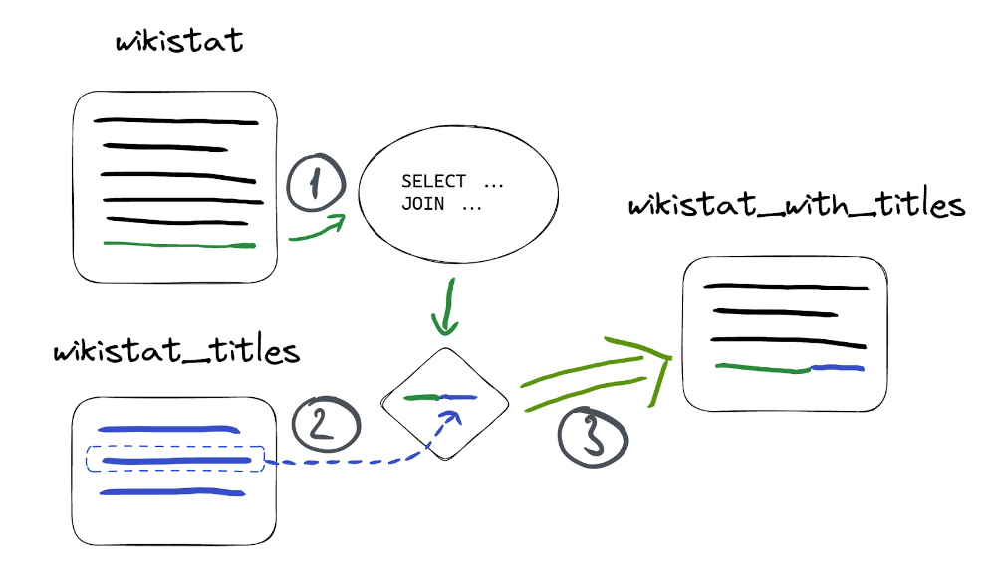

## Using Materialized Views in ClickHouse


### Intro

In the real world, data doesn’t only have to be stored, but processed as well. Processing is usually done on an application side using one[ of the available libraries](https://clickhouse.com/docs/en/interfaces/third-party/client-libraries/) for ClickHouse. Still, there are some critical processing points that can be moved to ClickHouse to increase the performance and manageability of the data. One of the most powerful tools for that in ClickHouse is [Materialized Views](https://clickhouse.com/docs/en/sql-reference/statements/create/view/#materialized-view).


### What is a Materialized View

A materialized view is a special trigger that stores the result of a given `SELECT` query to a target table:


This can be useful in many cases, but let’s take the most popular - making certain queries work faster.


#### Quick example

Let’s take 1b rows from the [Wikistat dataset](https://clickhouse.com/docs/en/getting-started/example-datasets/wikistat/) as an example:


```
CREATE TABLE wikistat
(
    `time` DateTime CODEC(Delta(4), ZSTD(1)),
    `project` LowCardinality(String),
    `subproject` LowCardinality(String),
    `path` String,
    `hits` UInt64
)
ENGINE = MergeTree
ORDER BY (path, time);

Ok.

INSERT INTO wikistat SELECT *
FROM s3('https://ClickHouse-public-datasets.s3.amazonaws.com/wikistat/partitioned/wikistat*.native.zst') LIMIT 1e9
```


Suppose we frequently query for the most popular projects for a certain date:


```
SELECT
    project,
    sum(hits) AS h
FROM wikistat
WHERE date(time) = '2015-05-01'
GROUP BY project
ORDER BY h DESC
LIMIT 10
```


This query takes a [ClickHouse Cloud](https://clickhouse.com/cloud) development service 15 seconds to complete:


```
┌─project─┬────────h─┐
│ en      │ 34521803 │
│ es      │  4491590 │
│ de      │  4490097 │
│ fr      │  3390573 │
│ it      │  2015989 │
│ ja      │  1379148 │
│ pt      │  1259443 │
│ tr      │  1254182 │
│ zh      │   988780 │
│ pl      │   985607 │
└─────────┴──────────┘

10 rows in set. Elapsed: 14.869 sec. Processed 972.80 million rows, 10.53 GB (65.43 million rows/s., 708.05 MB/s.)
```


If we have plenty of those queries and we need a subsecond performance from ClickHouse, we can create a materialized view for this query:


```
CREATE TABLE wikistat_top_projects
(
    `date` Date,
    `project` LowCardinality(String),
    `hits` UInt32
)
ENGINE = SummingMergeTree
ORDER BY (date, project);

Ok.

CREATE MATERIALIZED VIEW wikistat_top_projects_mv TO wikistat_top_projects AS
SELECT
    date(time) AS date,
    project,
    sum(hits) AS hits
FROM wikistat
GROUP BY
    date,
    project;
```


In these two queries:


* `wikistat_top_projects` is the name of the table that we’re going to use to save a materialized view,
* `wikistat_top_projects_mv` is the name of the materialized view itself (the trigger),
* we’ve used [SummingMergeTree](https://clickhouse.com/docs/en/engines/table-engines/mergetree-family/summingmergetree/) because we would like to have our hits value summarized for each date/project pair,
* everything that comes after `AS` is the query to build the materialized view from.

We can create any number of materialized views, but each new materialized view is an additional storage load, so keep the overall number sane. Good to keep it under 10 per table.

Now let’s populate materialized view table with the data from `wikistat` table:


```
INSERT INTO wikistat_top_projects SELECT
    date(time) AS date,
    project,
    sum(hits) AS hits
FROM wikistat
GROUP BY
    date,
    project
```


#### Query materialized view table

Since `wikistat_top_projects` is a table, we have all power of ClickHouse SQL to query it:


```
SELECT
    project,
    sum(hits) hits
FROM wikistat_top_projects
WHERE date = '2015-05-01'
GROUP BY project
ORDER BY hits DESC
LIMIT 10

┌─project─┬─────hits─┐
│ en      │ 34521803 │
│ es      │  4491590 │
│ de      │  4490097 │
│ fr      │  3390573 │
│ it      │  2015989 │
│ ja      │  1379148 │
│ pt      │  1259443 │
│ tr      │  1254182 │
│ zh      │   988780 │
│ pl      │   985607 │
└─────────┴──────────┘

10 rows in set. Elapsed: 0.003 sec. Processed 8.19 thousand rows, 101.81 KB (2.83 million rows/s., 35.20 MB/s.)
```


Notice this took ClickHouse 3ms to generate the same result, as opposed to 15 seconds with the original query. Also mention, that we still need to use `GROUP BY` as `SummingMergeTree` engine is async (this saves resources and reduces impact on query processing) and some values can be uncalculated.


#### Managing materialized views

Materialized views appear under `SHOW TABLES` query:


```
SHOW TABLES LIKE 'wikistat_top_projects_mv'

┌─name─────────────────────┐
│ wikistat_top_projects_mv │
└──────────────────────────┘
```


We can drop materialized views using `DROP TABLE` but this will only delete the trigger itself:


```
DROP TABLE wikistat_top_projects_mv
```


Remember to drop target table as well if it’s not needed anymore:


```
DROP TABLE wikistat_top_projects
```


#### Getting materialized view size on disk

All metadata on materialized view tables is available in the system database. E.g., to get its size on disk, we can do the following:


```
SELECT
    rows,
    formatReadableSize(total_bytes) AS total_bytes
FROM system.tables
WHERE table = 'wikistat_top_projects'


┌──rows─┬─total_bytes_on_disk─┐
│ 15336 │ 37.42 KiB           │
└───────┴─────────────────────┘
```


#### Updating data in materialized views

The most powerful feature of materialized views is that the data is updated automatically once it arrives into the source tables used in the `SELECT` statement:


So we don’t have to additionally refresh data in the materialized view - everything is done automatically by ClickHouse. Suppose we insert new data into the `wikistat` table:


```
INSERT INTO wikistat
VALUES(now(), 'test', '', '', 10),
      (now(), 'test', '', '', 10),
      (now(), 'test', '', '', 20),
      (now(), 'test', '', '', 30);
```


Now let’s query the materialized view to verify the `hits` column is summed properly:


```
SELECT hits
FROM wikistat_top_projects
FINAL
WHERE (project = 'test') AND (date = date(now()))
```


We use `FINAL` modifier to make sure the summing engine returns summarized hits instead of individual, unmerged rows:


```
┌─hits─┐
│   70 │
└──────┘

1 row in set. Elapsed: 0.005 sec. Processed 7.15 thousand rows, 89.37 KB (1.37 million rows/s., 17.13 MB/s.)
```


In production environments it’s better to avoid `FINAL` for big tables and use `sum(hits)` instead. Also check [optimize_on_insert](https://clickhouse.com/docs/en/operations/settings/settings/#optimize-on-insert) settings option which controls how data is merged in insert.


### Speeding up aggregations using materialized views

As shown in the previous section, materialized views are a way to improve query performance. All kinds of aggregations are common for analytical queries, not only `sum()` as in the previous example. SummingMergeTree is useful for keeping a total of values, but there are more advanced aggregations that can be computed using the [AggregatingMergeTree](https://clickhouse.com/docs/en/engines/table-engines/mergetree-family/aggregatingmergetree/) engine. 

Suppose we have the following type of query being executed frequently:


```
SELECT
    toDate(time) AS date,
    min(hits) AS min_hits_per_hour,
    max(hits) AS max_hits_per_hour,
    avg(hits) AS avg_hits_per_hour
FROM wikistat
WHERE project = 'en'
GROUP BY date
```


This gives us the daily min, max and average of hits per hour for the given project:


```
┌───────date─┬─min_hits_per_hour─┬─max_hits_per_hour─┬──avg_hits_per_hour─┐
│ 2015-05-01 │                 1 │             36802 │  4.586310181621408 │
│ 2015-05-02 │                 1 │             23331 │  4.241388590780171 │
│ 2015-05-03 │                 1 │             24678 │  4.317835245126423 │
...
└────────────┴───────────────────┴───────────────────┴────────────────────┘


38 rows in set. Elapsed: 8.970 sec. Processed 994.11 million rows
```


Let's store these aggregated results using materialized view for faster retrieval. Aggregated results are defined using [state combinators](https://clickhouse.com/docs/en/sql-reference/aggregate-functions/combinators/#-state). State combinators ask ClickHouse to save the internal aggregated state instead of the final aggregation result. This allows using aggregations without having to save all records with original values. The approach is quite simple - we use *State() functions when creating materialized views and then their corresponding *Merge() functions at query time to get the correct aggregate results:


We’ll use `min`, `max`, and `avg` states in our example. In the target table for a new materialized view we’re going to use `[AggregateFunction](https://clickhouse.com/docs/en/sql-reference/data-types/aggregatefunction/)` type to store aggregation states instead of values:


```
CREATE TABLE wikistat_daily_summary
(
    `project` String,
    `date` Date,
    `min_hits_per_hour` AggregateFunction(min, UInt64),
    `max_hits_per_hour` AggregateFunction(max, UInt64),
    `avg_hits_per_hour` AggregateFunction(avg, UInt64)
)
ENGINE = AggregatingMergeTree
ORDER BY (project, date);

Ok.

CREATE MATERIALIZED VIEW wikistat_daily_summary_mv
TO wikistat_daily_summary AS
SELECT
    project,
    toDate(time) AS date,
    minState(hits) AS min_hits_per_hour,
    maxState(hits) AS max_hits_per_hour,
    avgState(hits) AS avg_hits_per_hour
FROM wikistat
GROUP BY project, date
```


Let’s also populate it with data:


```
INSERT INTO wikistat_daily_summary SELECT
    project,
    toDate(time) AS date,
    minState(hits) AS min_hits_per_hour,
    maxState(hits) AS max_hits_per_hour,
    avgState(hits) AS avg_hits_per_hour
FROM wikistat
GROUP BY project, date

0 rows in set. Elapsed: 33.685 sec. Processed 994.11 million rows
```


At the query time, we use the corresponding `Merge` combinator to retrieve values:


```
SELECT
    date,
    minMerge(min_hits_per_hour) min_hits_per_hour,
    maxMerge(max_hits_per_hour) max_hits_per_hour,
    avgMerge(avg_hits_per_hour) avg_hits_per_hour
FROM wikistat_daily_summary
WHERE project = 'en'
GROUP BY date
```


Notice we get exactly the same results but thousands of times faster:


```
┌───────date─┬─min_hits_per_hour─┬─max_hits_per_hour─┬──avg_hits_per_hour─┐
│ 2015-05-01 │                 1 │             36802 │  4.586310181621408 │
│ 2015-05-02 │                 1 │             23331 │  4.241388590780171 │
│ 2015-05-03 │                 1 │             24678 │  4.317835245126423 │
...
└────────────┴───────────────────┴───────────────────┴────────────────────┘


32 rows in set. Elapsed: 0.005 sec. Processed 9.54 thousand rows, 1.14 MB (1.76 million rows/s., 209.01 MB/s.)
```


Any [aggregate function](https://clickhouse.com/docs/en/sql-reference/aggregate-functions/) can be used with State/Merge combinator as a part of an aggregating materialized view.


### Compacting data to optimize storage

In some cases we only need to store aggregated data but ingesting is done in an event-based manner. If we still need raw data for the latest couple of days and it’s fine to save aggregated history, we can combine a materialized view and [TTL](https://clickhouse.com/docs/en/engines/table-engines/mergetree-family/mergetree#table_engine-mergetree-ttl) for the source table.

To optimize storage space, we can also declare column types explicitly to make sure the [schema is optimal](https://clickhouse.com/blog/optimize-clickhouse-codecs-compression-schema). Suppose we want to store monthly aggregated data only for each `path` from `wikistat` table:


```
CREATE MATERIALIZED VIEW wikistat_monthly_mv TO
wikistat_monthly AS
SELECT
    toDate(toStartOfMonth(time)) AS month,
    path,
    sum(hits) AS hits
FROM wikistat
GROUP BY
    path,
    month
```


The original table (data stored hourly) takes 3x more disk space than the aggregated materialized view:


<table>
  <tr>
   <td><strong>wikistat (original table)</strong>
   </td>
   <td><strong>wikistat_daily (materialized view)</strong>
   </td>
  </tr>
  <tr>
   <td><code>1.78GiB</code>
   </td>
   <td><strong><code>565.68 MiB</code></strong>
   </td>
  </tr>
  <tr>
   <td><code>1b rows</code>
   </td>
   <td><strong><code>~ 27m rows</code></strong>
   </td>
  </tr>
</table>


**_An important note here_** is that compacting only makes sense when the resulting number of rows will reduce by at least 10 times. In other cases, ClickHouse's powerful compression and encoding algorithms will show comparable storage efficiency without any aggregations.

Now that we have monthly aggregations, we can add a TTL expression to the original table so that the data is deleted after 1 week:


```
ALTER TABLE wikistat MODIFY TTL time + INTERVAL 1 WEEK
```


### Validating and filtering data

Another popular example when materialized views are used is processing data right after insertion. Data validation is a good example.


Let’s say we want to filter out all `path` values that contain unwanted symbols before saving them into the resulting table with clean data. We have around 1% of such values in our table:


```
SELECT count(*)
FROM wikistat
WHERE NOT match(path, '[a-z0-9\\-]')
LIMIT 5

Query id: b661934b-f091-4680-90d9-1782a43388aa

┌──count()─┐
│ 12168918 │
└──────────┘

1 row in set. Elapsed: 46.324 sec. Processed 994.11 million rows, 28.01 GB (21.46 million rows/s., 604.62 MB/s.)
```


To implement validation filtering we’ll need 2 tables - a table with all data and a table with clean data only. The materialized view will play the role of a final table with clean data, and the source table will be transitory. We can remove data from the source table either based on TTL, as we did in the previous section, or change the engine of this table to [Null](https://clickhouse.com/docs/en/engines/table-engines/special/null/), which does not store any data (the data will only be stored in the materialized view):


```
CREATE TABLE wikistat_src
(
    `time` DateTime CODEC(Delta(4), ZSTD(1)),
    `project` LowCardinality(String),
    `subproject` LowCardinality(String),
    `path` String,
    `hits` UInt64
)
ENGINE = Null
```


Now let’s create a materialized view using a data validation query:


```
CREATE TABLE wikistat_clean AS wikistat;

Ok.

CREATE MATERIALIZED VIEW wikistat_clean_mv TO wikistat_clean
AS SELECT *
FROM wikistat_src
WHERE match(path, '[a-z0-9\\-]')
```


When we insert data, wikistat_src will remain empty:


```
INSERT INTO wikistat_src SELECT * FROM s3('https://ClickHouse-public-datasets.s3.amazonaws.com/wikistat/partitioned/wikistat*.native.zst') LIMIT 1000
```


Let’s make sure source table is empty:


```
SELECT count(*)
FROM wikistat_src

┌─count()─┐
│       0 │
└─────────┘
```


But our `wikistat_clean` materialized table now has only valid rows:


```
SELECT count(*)
FROM wikistat_clean

┌─count()─┐
│      58 │
└─────────┘
```


The other 942 rows (1000 - 58) were excluded by our validation statement at insert time.


### Routing data to tables

Another example materialized views can be used for is to route data to different tables based on certain conditions:


For example, we might want to route invalid data into another table instead of dropping it. In that case, we create another materialized view but with a different query:


```
CREATE TABLE wikistat_invalid AS wikistat;

Ok.

CREATE MATERIALIZED VIEW wikistat_invalid_mv TO wikistat_invalid
AS SELECT *
FROM wikistat_src
WHERE NOT match(path, '[a-z0-9\\-]')
```


When we have single materialized views for the same source table, they will be processed in the alphabetical order. Remember not to create more than a couple of tens of materialized views per source table as performance can degrade.

If we insert the same data again, we will find 942 invalid rows in `wikistat_invalid` materialized view:


```
SELECT count(*)
FROM wikistat_invalid

┌─count()─┐
│     942 │
└─────────┘
```


### Transforming data

Since materialized views are based on the result of a query, we can use all the power of ClickHouse functions in our SQL to transform source values to enrich and improve data clarity. As a quick example, let’s merge `project`, `subproject` and `path` columns into a single “page” column and split time into `date` and `hour` columns:


```
CREATE TABLE wikistat_human
(
    `date` Date,
    `hour` UInt8,
    `page` String
)
ENGINE = MergeTree
ORDER BY (page, date);

Ok.

CREATE MATERIALIZED VIEW wikistat_human_mv TO wikistat_human
AS SELECT
    date(time) AS date,
    toHour(time) AS hour,
    concat(project, if(subproject != '', '/', ''), subproject, '/', path) AS page,
    hits
FROM wikistat
```


Now `wikistat_human` will be populated with the transformed data on the fly:


```
┌───────date─┬─hour─┬─page──────────────────────────┬─hits─┐
│ 2015-11-08 │    8 │ en/m/Angel_Muñoz_(politician) │    1 │
│ 2015-11-09 │    3 │ en/m/Angel_Muñoz_(politician) │    1 │
└────────────┴──────┴───────────────────────────────┴──────┘
```


### Creating materialized views in production

New data is automatically added to materialized views when source data arrives. But in order to populate materialized view with existing data on production environments we have to follow the simple scenario:

1. Pause write to the source table.
2. Create materialized view.
3. Populate the target table with data from the source table.
4. Restart writes to the source table.

Alternatively, we can use a certain time point in the future while creating materialized view:


```
CREATE MATERIALIZED VIEW mv TO target_table
AS SELECT …
FROM soruce_table WHERE date > today()
```


Thus our materialized view will begin triggering tomorrow, so we have to wait until tomorrow and populate historical data with the following query:


```
INSERT INTO target_table
SELECT ...
FROM soruce_table WHERE date < today()
```


### Materialized views and JOINs

Since materialized views work with a result of an SQL query, we can use JOINs as well as any other SQL feature. But JOINs should be used with caution.

Suppose we have a table with page titles for our `wikistat` dataset:


```
CREATE TABLE wikistat_titles
(
    `path` String,
    `title` String
)
ENGINE = MergeTree
ORDER BY path
```


This table has page titles associated with path:


```
SELECT *
FROM wikistat_titles

┌─path─────────┬─title────────────────┐
│ Ana_Sayfa    │ Ana Sayfa - artist   │
│ Bruce_Jenner │ William Bruce Jenner │
└──────────────┴──────────────────────┘
```


We can now create a materialized view that joins `title` from the `wikistat_titles` table on the `path` value:


```
CREATE TABLE wikistat_with_titles
(
    `time` DateTime,
    `path` String,
    `title` String,
    `hits` UInt64
)
ENGINE = MergeTree
ORDER BY (path, time);

Ok.

CREATE MATERIALIZED VIEW wikistat_with_titles_mv TO wikistat_with_titles
AS SELECT time, path, title, hits
FROM wikistat AS w
INNER JOIN wikistat_titles AS wt ON w.path = wt.path
```


Note that we use `INNER JOIN`, so we’ll have only records that have corresponding values in the `wikistat_titles` table after populating:


```
SELECT * FROM wikistat_with_titles LIMIT 5

┌────────────────time─┬─path──────┬─title──────────────┬─hits─┐
│ 2015-05-01 01:00:00 │ Ana_Sayfa │ Ana Sayfa - artist │    5 │
│ 2015-05-01 01:00:00 │ Ana_Sayfa │ Ana Sayfa - artist │    7 │
│ 2015-05-01 01:00:00 │ Ana_Sayfa │ Ana Sayfa - artist │    1 │
│ 2015-05-01 01:00:00 │ Ana_Sayfa │ Ana Sayfa - artist │    3 │
│ 2015-05-01 01:00:00 │ Ana_Sayfa │ Ana Sayfa - artist │  653 │
└─────────────────────┴───────────┴────────────────────┴──────┘
```


Let’s insert a new record into the `wikistat` table to see how our new materialized view works:


```
INSERT INTO wikistat VALUES(now(), 'en', '', 'Ana_Sayfa', 123);

1 row in set. Elapsed: 1.538 sec. 
```


We can see our new row in `wikistat_with_titles`:


```
SELECT *
FROM wikistat_with_titles
ORDER BY time DESC
LIMIT 3

┌────────────────time─┬─path─────────┬─title────────────────┬─hits─┐
│ 2023-01-03 08:43:14 │ Ana_Sayfa    │ Ana Sayfa - artist   │  123 │
│ 2015-06-30 23:00:00 │ Bruce_Jenner │ William Bruce Jenner │  115 │
│ 2015-06-30 23:00:00 │ Bruce_Jenner │ William Bruce Jenner │   55 │
└─────────────────────┴──────────────┴──────────────────────┴──────┘
```


But what happens if we add data to the `wikistat_titles` table? Let’s check:


```
INSERT INTO wikistat_titles
VALUES('Academy_Awards', 'Oscar academy awards');
```


Nothing will appear in the materialized view even though we have corresponding values in the `wikistat` table:


```
SELECT *
FROM wikistat_with_titles
WHERE path = 'Academy_Awards'

0 rows in set. Elapsed: 0.003 sec.
```


That’s because a materialized view only triggers when its source table receives inserts. It's just a trigger on the source table and knows nothing about the join table. In our case, `wikistat` is the source table for the materialized view, and `wikistat_titles` is a table we join to:





That’s why nothing appeared in our materialized view - nothing was inserted into `wikistat` table. But let’s insert something to it:


```
INSERT INTO wikistat VALUES(now(), 'en', '', 'Academy_Awards', 456);
```


We can see new records in materialized view:


```
SELECT *
FROM wikistat_with_titles
WHERE path = 'Academy_Awards'

┌────────────────time─┬─path───────────┬─title────────────────┬─hits─┐
│ 2023-01-03 08:56:50 │ Academy_Awards │ Oscar academy awards │  456 │
└─────────────────────┴────────────────┴──────────────────────┴──────┘
```


**Be careful**, since JOINs can dramatically downgrade insert performance when joining on large tables. Consider using [dictionaries](https://clickhouse.com/docs/en/sql-reference/dictionaries/external-dictionaries/external-dicts/) as a more efficient alternative.


### Summary

Materialized views are a powerful tool in ClickHouse to improve query performance and extend data management capabilities. You can even use JOINs with materialized views. Consider materialized columns as a quick alternative when no aggregation or filtering is required.
